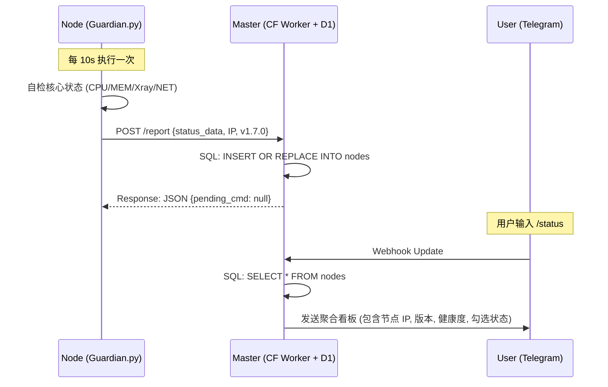
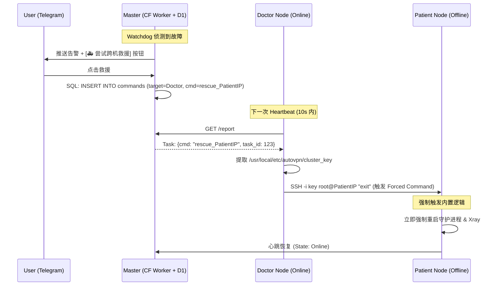
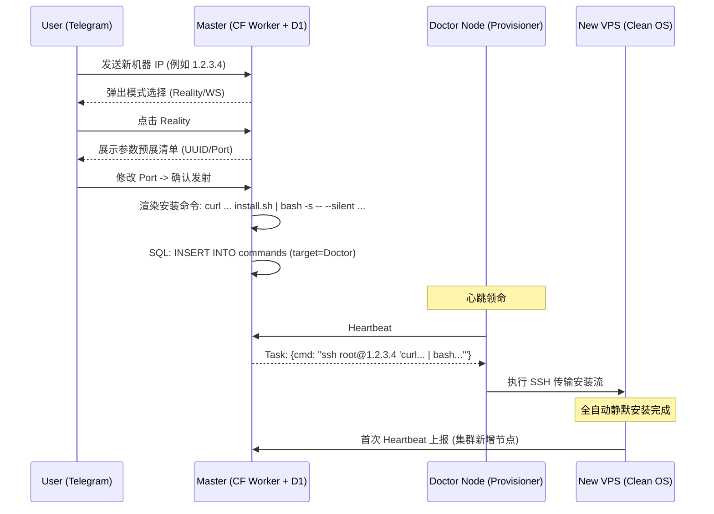
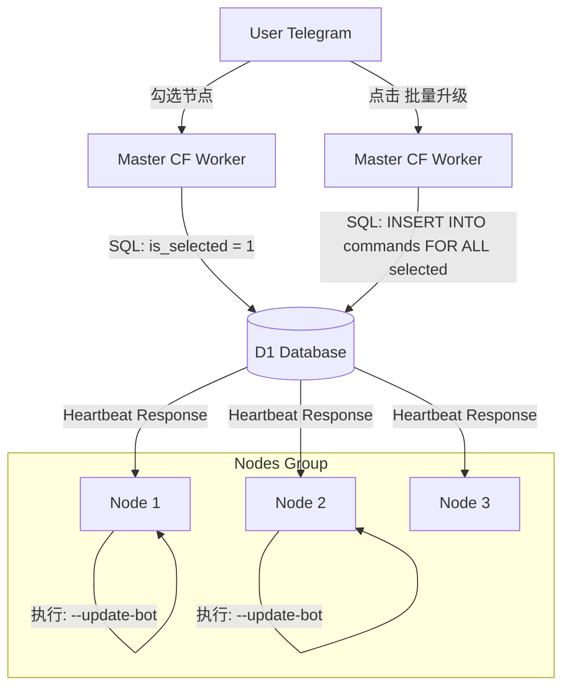

# AutoVPN v1.7.0 全链路技术信息流 (Sentinel Edition)

本文件详细刻画了 **AutoVPN v1.7.0** 架构中所有功能的核心信息传输流。

---

## 1. 核心看板与监控流 (Status & Monitoring)
这是集群的“基础代谢”，保证 Master 随时掌握所有节点的状态。

---

## 2. 跨机自愈流 (Sentinel Rescue)
当 A 节点失联且无法自动拉起时，利用互信机制通过 B 节点强行修复。

---

## 3. 互动式部署向导 (Wizard Deployment)
从手机发送一个 IP 到全自动扩容新机器的全过程。

---

## 4. 批量管理流 (Bulk Operations)
点击一个按钮，全集群同步升级。

---

## 5. 安全体系 (Security Model)
- **命令锁死**: 密钥对登录必须前置 `command="/usr/bin/python3 ..."`。
- **配置隔离**: 节点不知道云端 DB 账号，仅通过一个一次性的 `CLUSTER_TOKEN` 进行鉴权通讯。
- **环境隔离**: `Doctor` 节点只负责传递 Master 渲染好的“指令包”，不接触或存储任何部署后的动态密钥。

AutoVPN v1.7.0 构建了一个基于 **信任链 (Chain of Trust)** 的高可用自治集群。
