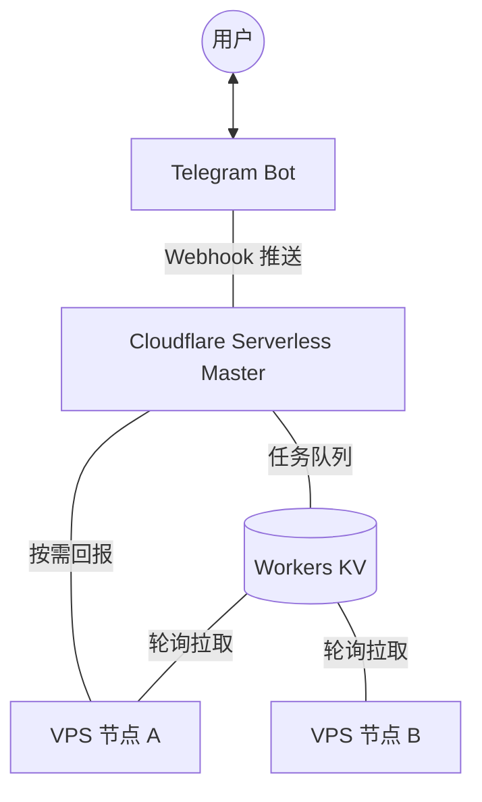

# AutoVPN 技术流程全解析 (Serverless v1.2.0)

本文件详细解释 AutoVPN 系统的 **全 Serverless (Webhook)** 架构工作机理。

---

## 1. 系统架构进化 (Architecture v1.2.0)

在 v1.2.0 中，我们移除了 VPS 端的 Master 角色，将“大脑”完全迁往 Cloudflare Worker。

### 核心改进：
- **无感 Master**: 不再指定哪台 VPS 是主控，所有 VPS 均为平等节点。
- **Webhook 驱动**: Telegram 指令直接推送到 CF Worker，响应速度更快，彻底规避 VPS IP 被封的风险。
- **按需同步 (On-demand)**: 极大降低了 KV 写入频率，适配 Cloudflare 免费版额度。

---

## 2. 核心工作流：按需状态报告 (On-demand Sync)

为了节省 Cloudflare KV 的写入次数（每天限额 1000 次），系统采用了“被动”报告机制：

1. **用户操作**: 在 Telegram 发送 `/status`。
2. **CF Worker**: 接收 Webhook，在 KV 中设置 `status_request_active` 标记。
3. **VPS 节点**: 每 5-10 秒执行一次 `GET /report`（读取 KV 不限次数/额度充足）。
4. **VPS 节点**: 发现 `status_request_active` 标记。
5. **VPS 节点**: 执行 `POST /report` 上传最新的 CPU、内存和版本数据。
6. **用户刷新**: 点击 `[🔄 刷新数据]` 按钮，即可看到刚上报的最新快照。

---

## 3. 异步指令下发 (CMD Dispatch)

当你点击 `[重启 Xray]` 或勾选升级时：

1. **CF Worker**: 直接将 `{cmd: "...", task_id: "..."}` 写入对应节点的 KV 槽位 (`cmd_[node_id]`)。
2. **VPS 节点**: 下一次轮询时取走任务。
3. **VPS 节点**: 执行本地命令。
4. **VPS 节点**: 指令执行完后静默等待下一个任务。

---

## 4. 多节点勾选升级 (Serverless UI)

1. **状态存储**: 勾选状态（✅/☐）实时存储在 CF KV 中 (`registry_[msg_id]`)。
2. **快速响应**: 点击按钮仅涉及云端 KV 的读写，无需往返 VPS，交互体验极佳。
3. **批量分发**: 确认升级后，Worker 为所有选中节点生成独立的升级任务。

---

## 5. 安全性说明 (Security)

- **CLUSTER_TOKEN**: 节点通讯依然受私有 Token 保护。
- **加密存储**: `BOT_TOKEN` 和 `CHAT_ID` 安全存储在 Cloudflare KV 的 Namespace 中。
- **Webhook 隔离**: 只有来自 Telegram 官方域名的 POST 请求才会被处理。

---

通过这套架构，AutoVPN 真正实现了 **“零维护感”** 的集群管理。
