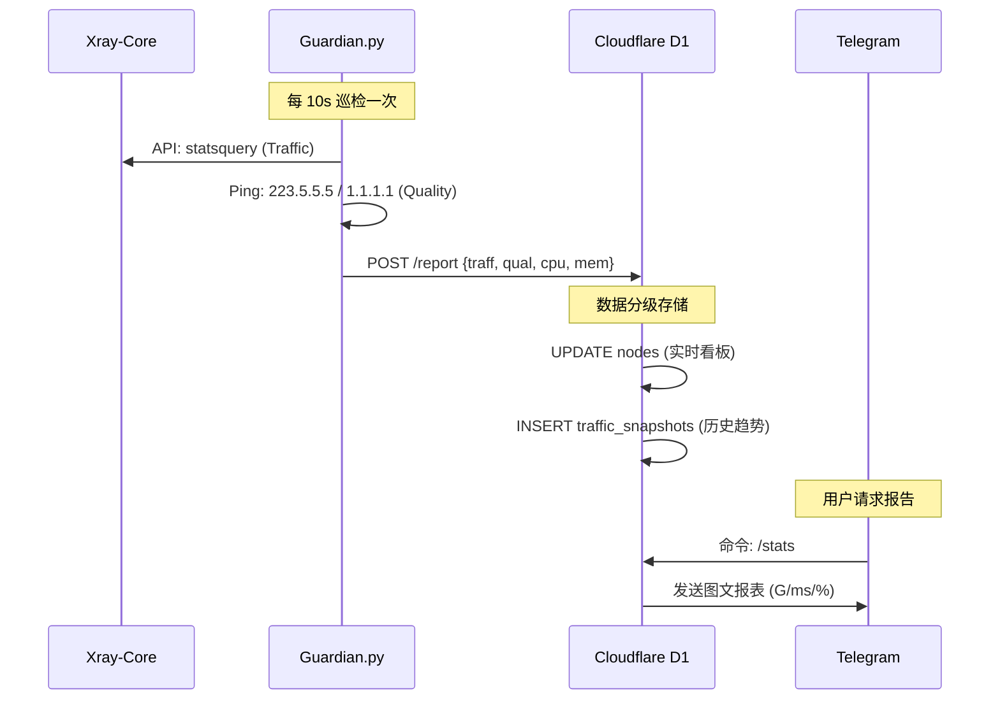
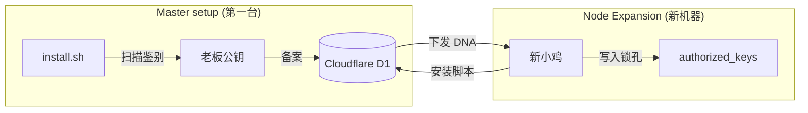
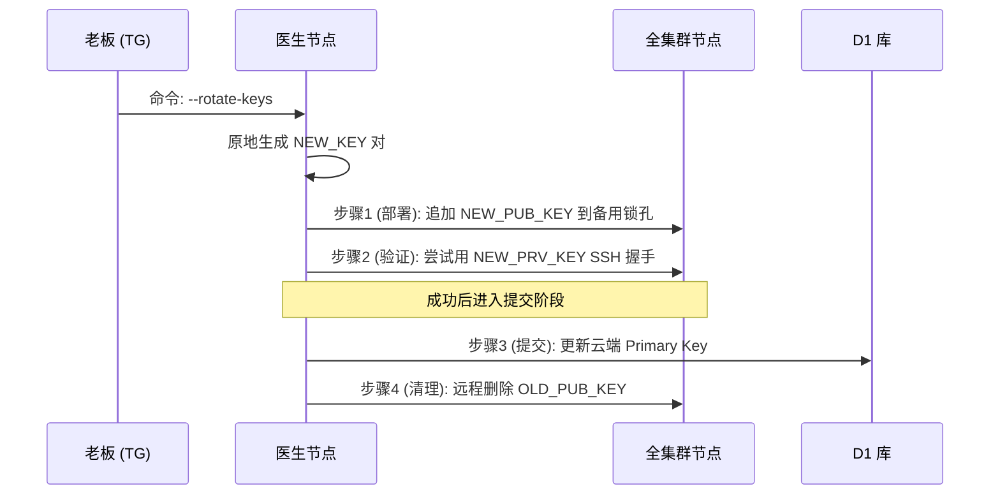

# AutoVPN v1.8.3 全链路技术信息流 (Security & Data Edition)

本文件详细刻画了 **AutoVPN v1.8.3** 架构中所有核心功能的技术实现流。

---

## 1. 监控与数据罗盘流 (Data Compass)
节点不仅上报存活状态，还通过 Xray API 采集流量与质量数据。

---

## 2. 老板 DNA 基因同步 (Owner Guard)
确保“谁装的谁就是唯一老板”，且权限能在集群内自动扩散。

---

## 3. 密钥无感轮换 (Zero-Downtime Rotation)
三步走安全算法，防止机器人运维由于换钥匙而发生“物理断连”。

---

## 4. 安全命令中心 (Security Center)
- **双锁并进**: 每一个节点同时挂载 **Boss Key (Full Root)** 和 **Robot Key (Restricted)**。
- **Forced Command**: 机器人钥匙被锁定在 `guardian.py --rescue-worker` 命令内，即便私钥泄露，黑客也无法执行任意命令。
- **云端持久化**: 所有的 SSH 资产（除了老板私钥）均在 Cloudflare D1 加密存储，实现“换机不换群”。

AutoVPN v1.8.3 构建了一个 **“去中心化执行，云端化配置”** 的高安全性代理集群。
