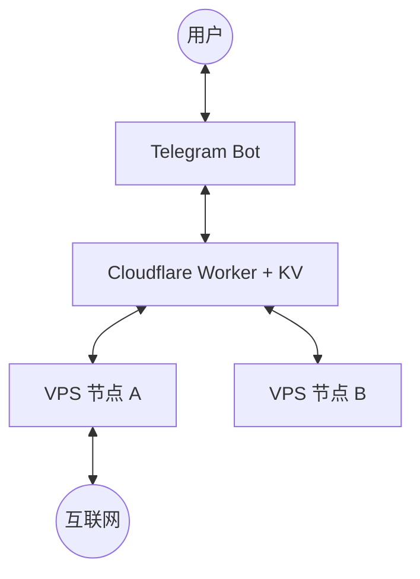

# AutoVPN 技术流程全解析 (Technical Workflow)

本文件旨在详细解释 AutoVPN 系统的内部工作机理，帮助用户和开发者理解各组件是如何协同工作的。

---

## 1. 宏观系统架构 (Architecture Overview)

AutoVPN 采用的是 **“异步信令 (Asynchronous Signaling)”** 架构。这意味着 Telegram Bot 不直接通过 SSH 连接你的 VPS，而是通过 Cloudflare Worker 进行“传话”。

### 核心组件角色：
- **Telegram Bot**: 交互界面，负责接收指令 (如 `/status`) 并向 Cloudflare 写入待办任务。
- **Cloudflare Worker**: “情报枢纽”，利用 KV 存储持久化所有节点的状态和待处理指令。
- **VPS 节点 (Guardian.py)**: “驻场特工”，每隔几秒钟向 Worker 报平安，并取走属于自己的任务。

---

## 2. 核心工作流：集群状态上报 (Heartbeat Flow)

这是系统保持“在线”状态的核心循环。

1. **VPS 节点** 定期执行 `get_status_data()`。
2. 收集：Xray 运行状态、CPU 占比、内存占用情况、脚本版本。
3. 发送 `POST /report` 请求到 Cloudflare Worker。
4. **Cloudflare Worker** 接收数据，解析节点 ID，将其状态写入 **KV 存储**（有效期通常为 24 小时）。
5. 用户在 Telegram 发送 `/status` 时，Bot 从 KV 调取所有节点的快照并渲染成可视化条目。

---

## 3. 核心工作流：异步指令下发 (CMD Dispatch Flow)

当你点击 Telegram 上的 `[重启 Xray]` 按钮时，发生了什么？

1. **TG Bot**: 收到回调指令，将一条 JSON 任务写入 Cloudflare KV (`CMD_QUEUE:[NODE_ID]`)。
2. **VPS 节点**: 下一次上报（Heartbeat）时，Worker 会在返回结果中夹带这条指令。
3. **VPS 节点**: 执行指令 (`systemctl restart xray`)。
4. **VPS 节点**: 执行完毕后，将结果发回 `POST /result`。
5. **TG Bot**: 轮询或在下次查询时，将执行结果反馈给用户。

> [!TIP]
> 这种设计的好处是：即便 VPS 处于 NAT 后面或没有公网 IP，只要它能访问 HTTPS，就能被管理。

---

## 4. 机器人 Pro 版交互逻辑 (UX Engine)

为了让交互感觉像“秒回”，我们引入了以下逻辑：

### A. 实时动画 (Typings)
当你输入指令，机器人会立即发送 `sendChatAction(typing)`。这会让你在 TG 顶栏看到“机器人正在输入...”，显著降低等待焦虑。

### B. 内联渲染 (Inline Buttons)
机器人不再发送纯文本，而是使用 `InlineKeyboardMarkup`。点击按钮会触发 `CallbackQuery`，由 `guardian.py` 中的事件循环捕获并处理。

---

## 5. 无感自更新流程 (OTA Update)

这是保持系统最新的关键。

1. 用户输入 `/update`。
2. **Guardian.py** 访问 GitHub 获取 `install.sh`。
3. 执行 `bash install.sh --update-bot`。
4. **install.sh** 识别 `--update-bot` 参数，进入“静默更新模式”。
5. 下载并覆盖旧的 `guardian.py`。
6. 调用 `systemctl restart autovpn-guardian`。
7. 新版本上线并向用户发送完成通知。

---

## 6. 安全性说明 (Security)

- **CLUSTER_TOKEN**: 所有的通讯（VPS <-> CF, TG <-> CF）都带有此 Token。如果 Token 不匹配，Cloudflare 会直接拒绝请求。
- **无 SSH 依赖**: 因为是异步信令，你完全可以关闭 VPS 的 22 端口，只要保留 443 访问能力即可。

---

希望这份文档能帮你理清脉络！如有更多疑问，请随时查阅代码中对应的 `guardian.py` 和 `cf_worker_relay.js` 实现。
